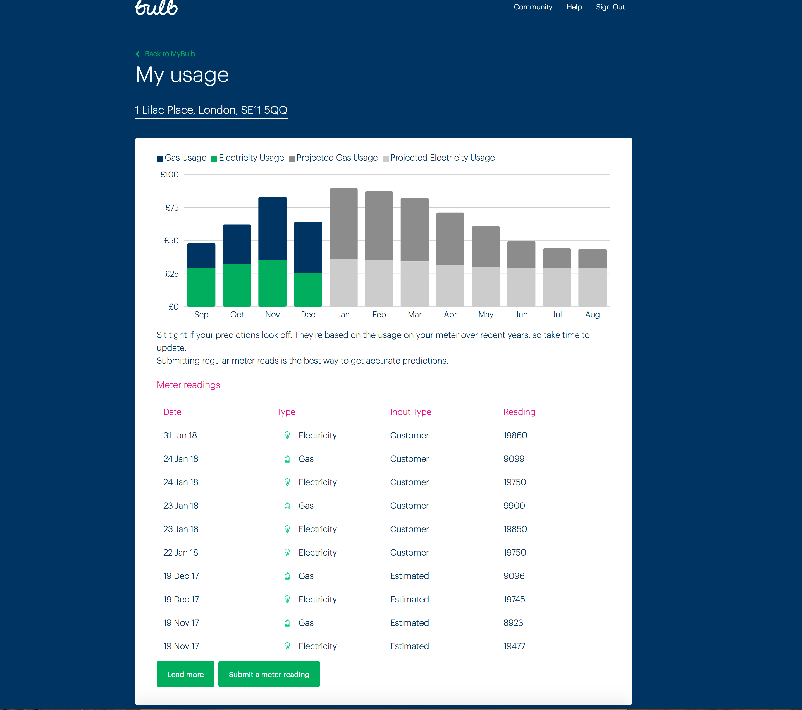

# Interview Challenge - Energy usage

Thank you for interviewing at Bulb and making the time to do some homework.

## Goal

We have designed a couple of exercices to help us test you and have some support for discussion when you come in.
The topic is meter readings and energy usage. In a nutshell, imagine you have just joined Bulb and your first task is to help Bulb members (i.e. customers) to view their meter readings and energy usage. For illustration purposes here is what we currently display to our Bulb members.

## Tasks

### Overview

There are two tasks:

* Implement an energy usage calculator that derives energy usage from meter readings, see [dataprocessor](./dataprocessor)
* Develop a web application for displaying energy usage and meter readings, see [webapp](./webapp)

Each task is detailled in its own project README file.

### Expectation

We appreciate that life is busy, so the first thing we ask you to do is to pick one single task to focus on.
 
Next, we want you to decide on the time you desire to allocate to this task. We recommend you spend no more than 2 or 3 hours.

As you are working on your task, feel free to challenge and make any decisions you want. Just remember to explain your reasoning to us. Also, hopefully, you will get chance to walk us through your implementation when you come in.

### Notes

* If you experience any problems with the setup of any project, don't hesitate to reach out to us.
